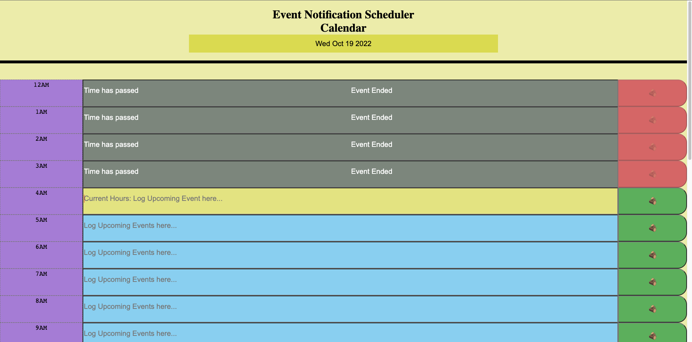

# Event Notification Scheduler

## Description

This website contains contains current date and will be updated real time and also each hour sections to log any appointments, events, chores, etc. This application is an everyday use because it will let you know real time if each hour has passed, which will turn the input section gray and white text that the time has passed and events logged has ended and unable to be edited. As for the current hour, the input section will turn yellow and will be able to be edited and any value inputted will be saved even after the page reloaded or refreshed. User are able to log anything for the future hours and will be saved also even after page is reloaded. Added a few extra feature like giving user validation, if they are trying to log something, a pop will appear saying "Logged Succesfully" and if user is trying it log and the textbox is empty, a pop will appear, giving the user a message that "It's Empty". Another feature added is when every hour passes, the button correspondting to each local storage box will be disabled. Last feature that was added is whenever it is a the next day, the local storage where previous event was logged will all be removed and start fresh. 

## Usage

This app can be use to make everyones life easier. We often forget appointments, chores and anything we have to do in general. This app helps user log their everyday events and will be saved even after the user exit out of the app. A great tool for everyday use so we dont forget and just get right into it!

## URL

https://junnel308.github.io/event_scheduler_notification/

## Screenshots

## Credits

Robert Wijtman (Instructor), Bootcamp Modules, w3schools.com, stackoverflow.com.

## License

MIT License

Copyright (c) 2022 JP Padilla

Permission is hereby granted, free of charge, to any person obtaining a copy
of this software and associated documentation files (the "Software"), to deal
in the Software without restriction, including without limitation the rights
to use, copy, modify, merge, publish, distribute, sublicense, and/or sell
copies of the Software, and to permit persons to whom the Software is
furnished to do so, subject to the following conditions:

The above copyright notice and this permission notice shall be included in all
copies or substantial portions of the Software.

THE SOFTWARE IS PROVIDED "AS IS", WITHOUT WARRANTY OF ANY KIND, EXPRESS OR
IMPLIED, INCLUDING BUT NOT LIMITED TO THE WARRANTIES OF MERCHANTABILITY,
FITNESS FOR A PARTICULAR PURPOSE AND NONINFRINGEMENT. IN NO EVENT SHALL THE
AUTHORS OR COPYRIGHT HOLDERS BE LIABLE FOR ANY CLAIM, DAMAGES OR OTHER
LIABILITY, WHETHER IN AN ACTION OF CONTRACT, TORT OR OTHERWISE, ARISING FROM,
OUT OF OR IN CONNECTION WITH THE SOFTWARE OR THE USE OR OTHER DEALINGS IN THE
SOFTWARE.
